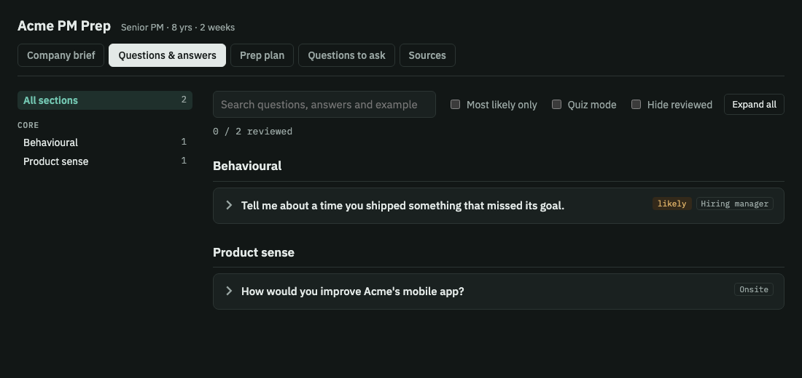

# PM Interview Prep

Turns your CV (and optionally a target company + JD) into a private interview-prep web app, then runs a live mock interview.

## What you get

- **50–90 likely questions** tuned to your level (APM → CPO) and variant (AI PM, platform, growth, B2B/enterprise)
- **"Say it like this"** — spoken, first-person model answers
- **Your live example** — each answer is anchored to a real item from your CV (placeholders where a number is missing — it never invents your experience)
- **Best possible outcome**, follow-ups, and strong-answer vs red-flag notes
- **Company brief** with sourced facts (company-specific mode), a **prep plan** sized to your timeline, and **questions to ask** each interviewer
- **Mock interview** — one question at a time, scored 1–4 on structure, specificity, judgment and level fit, with a tightened version of your answer

## 🖼️ Output preview

The main output is a single-page **HTML web app**. Open [`assets/sample-output.html`](assets/sample-output.html) in any browser to try a sample (placeholder data).



- **Claude:** publishes it as a private artifact link.
- **ChatGPT / Gemini:** returns the full HTML in Canvas or a code block. Save it as `prep.html` and double-click to open.
- **Command line:** saves `<slug>-prep.html` in the current folder.

## Try it

> "Help me prep for a Director of Product interview at Stripe. Here's my CV and the JD."

> "General PM interview prep for Group PM roles at B2B SaaS companies — CV attached."

## Works best with

Web search enabled, and an agent that can publish HTML (Claude artifacts). Without that, it still produces the full Q&A content in chat.

## 📥 Install

Pick your platform, then your device. Every path ends with the same check: **start a new chat and run the test prompt below**.

> Get the files first: `git clone https://github.com/SridharIyer10/CtrlAltLazy.git`, then open `skills/pm/pm-interview-prep`. To make an upload-ready zip, run `./scripts/package-skills.sh` from the repo root (the zip lands in `dist/pm-interview-prep.zip`).

### Claude

| Device | Steps |
|---|---|
| **Web** (claude.ai) | 1. Open [claude.ai](https://claude.ai) → **Settings → Capabilities → Skills**.<br>2. Click **Upload skill** and choose `dist/pm-interview-prep.zip`.<br>3. Switch the skill **On**.<br>4. Start a new chat and run the test prompt. |
| **Desktop** (Mac / Windows) | 1. Open the Claude desktop app → **Settings → Capabilities → Skills**.<br>2. Click **Upload skill** and choose `dist/pm-interview-prep.zip`.<br>3. Switch the skill **On**, start a new chat, and run the test prompt. |
| **App** (iOS / Android) | 1. Upload the skill once on web or desktop (steps above). Skills are tied to your account, so it syncs to the app.<br>2. Open the Claude app, start a new chat, and run the test prompt.<br>3. No skill option? Create a **Project** on web, paste `SKILL.md` into its instructions, then open that Project in the app. |
| **Command line** (Claude Code) | See the commands below. |

```bash
# Install for all your projects
mkdir -p ~/.claude/skills && cp -r skills/pm/pm-interview-prep ~/.claude/skills/

# Or for one project only
mkdir -p .claude/skills && cp -r skills/pm/pm-interview-prep .claude/skills/

# Run it
claude
```

### ChatGPT

| Device | Steps |
|---|---|
| **Web** (chatgpt.com) | 1. Open [chatgpt.com/gpts/editor](https://chatgpt.com/gpts/editor) (**Explore GPTs → Create**).<br>2. Under **Configure**, paste all of `SKILL.md` into **Instructions**.<br>3. No extra files to upload for this skill.<br>4. Click **Create**, choose **Only me**, then run the test prompt. |
| **Desktop** (Mac / Windows) | 1. Create the GPT on the web (steps above).<br>2. Open the ChatGPT desktop app, pick your GPT from the sidebar, and run the test prompt.<br>3. No GPT access? Paste `SKILL.md` as the first message of a chat, then send the test prompt. |
| **App** (iOS / Android) | 1. Create the GPT on the web (steps above).<br>2. Open the ChatGPT app → sidebar → your GPT, and run the test prompt.<br>3. No GPT access? Paste `SKILL.md` as the first message, then the test prompt. |
| **Command line** (Codex CLI) | See the commands below. |

```bash
# Codex CLI reads AGENTS.md from the current folder
cp skills/pm/pm-interview-prep/SKILL.md ./AGENTS.md
codex "Help me prep for a Senior PM interview at [company]. My CV is attached."
```

### Google Gemini

| Device | Steps |
|---|---|
| **Web** (gemini.google.com) | 1. Open [gemini.google.com/gems](https://gemini.google.com/gems) → **New Gem**.<br>2. Name it `PM Interview Prep` and paste all of `SKILL.md` into **Instructions**.<br>3. No extra files to upload for this skill.<br>4. Click **Save**, open the Gem, and run the test prompt. |
| **Desktop** (Mac / Windows) | 1. Gemini runs in the browser on desktop. Create the Gem on the web (steps above).<br>2. Optional: in Chrome, open the address bar's install icon (or **⋮ → Cast, save and share → Install page as app**) to pin Gemini as a desktop app.<br>3. Open your Gem and run the test prompt. |
| **App** (iOS / Android) | 1. Create the Gem on the web (steps above).<br>2. Open the Gemini app → **Gems** → your Gem, and run the test prompt.<br>3. No Gems access? Paste `SKILL.md` as the first message, then the test prompt. |
| **Command line** (Gemini CLI) | See the commands below. |

```bash
# Gemini CLI reads GEMINI.md from the current folder
cp skills/pm/pm-interview-prep/SKILL.md ./GEMINI.md
gemini -p "Help me prep for a Senior PM interview at [company]. My CV is attached."
```

### ✅ Test prompt (all platforms)

> Help me prep for a Senior PM interview at [company]. My CV is attached.

If the reply follows the steps described in [`SKILL.md`](SKILL.md), the install worked.

## ⌨️ Command-line prompts

Copy, edit the `[brackets]`, and paste into the CLI (or into any chat).

```bash
# Claude Code
claude "Use the pm-interview-prep skill. Prep me for a [level] PM interview at [company]. CV: ./cv.pdf, JD: ./jd.txt"

# Codex CLI (ChatGPT)
codex "Prep me for a [level] PM interview at [company]. CV: $(cat cv.txt) JD: $(cat jd.txt)"

# Gemini CLI
gemini -p "Prep me for a [level] PM interview at [company]. CV: $(cat cv.txt) JD: $(cat jd.txt)"

# Mock interview (any CLI, after the prep is built)
claude "Run a mock interview for the [company] role, one question at a time, and score each answer 1-4"
```

## Files

- [`SKILL.md`](SKILL.md) — the skill itself
- [`assets/sample-output.html`](assets/sample-output.html) — sample of the web app it builds (placeholder data)
- [`assets/preview.png`](assets/preview.png) — screenshot of that sample
