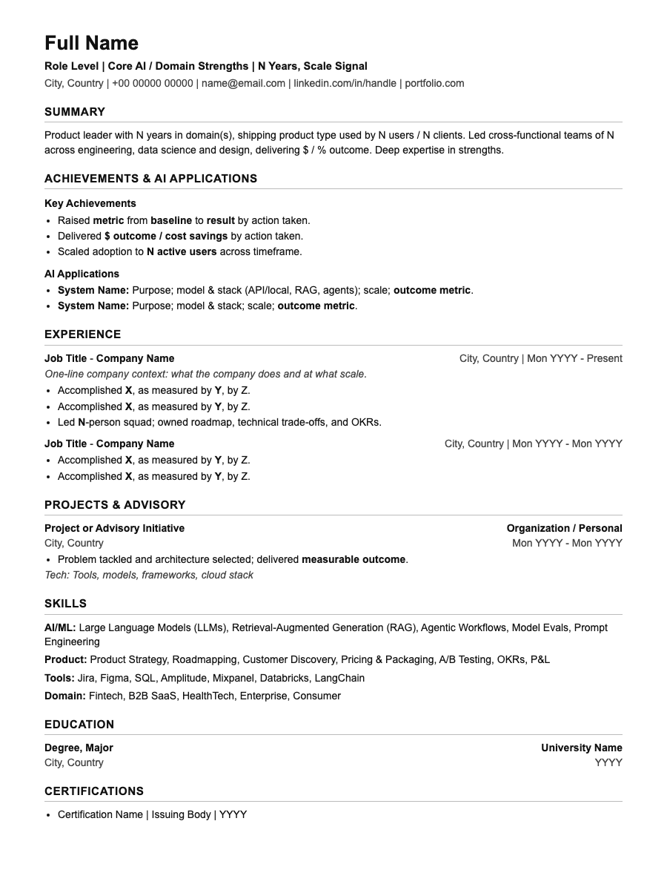

# PM Resume Prep

Audits, stress-tests, and rebuilds any Product Manager resume (Associate PM to CPO) for ATS compliance, architectural depth, and executive hiring standards. 

Designed to run natively across **Google Gemini**, **ChatGPT**, and **Claude**.

---

## What you get

- **Hard Core Match Score (0–100%)** — Calibrated by years of experience (<5 yrs, 5–10 yrs, 10–15 yrs, 15+ yrs) across 6 dimensions: Scope & Scale, AI/ML Maturity, Leadership Level, Execution & Craft, JD Coverage, and ATS presentation.
- **Stress-Test Audit** — Quotes exact phrases from your CV across 5 failure points: Buzzword Bleed, Metric Voids, Vague Architectural Claims, Undersold Technical Capital, and ATS/Format Penalties.
- **Gap Analysis** — Categorizes missing elements into Critical AI/Domain Imperatives, Business & Scale Gaps, and Tooling/Keywords, tagged as `[Likely have, not shown]` or `[True gap]`.
- **The 3 Weakest Bullets Rewritten** — Original vs. critique vs. executive rewrite using Google's **X-Y-Z formula** (*Accomplished [X], as measured by [Y], by doing [Z]* with bold metrics).
- **Humanizer Pass** — Strips robotic AI writing clichés, superficial `-ing` endings, and corporate fluff, keeping your authentic voice.
- **ATS-Friendly HTML & A4 PDF** — Single-column, semantic HTML with strict print CSS (`break-inside: avoid` on every company card). Renders a clean PDF of at most 3 pages.

---

## 🖼️ Output preview

The resume is delivered as a single-column, ATS-friendly **HTML page** (then printed to A4 PDF). This is the template it fills in — open [`assets/resume-template.html`](assets/resume-template.html) in a browser to see it live.



---

## 📥 Install

Pick your platform, then your device. Every path ends with the same check: **start a new chat and run the test prompt below**.

> Get the files first: `git clone https://github.com/SridharIyer10/CtrlAltAI.git`, then open `skills/pm/pm-resume-prep`. To make an upload-ready zip, run `./scripts/package-skills.sh` from the repo root (the zip lands in `dist/pm-resume-prep.zip`).

### Claude

| Device | Steps |
|---|---|
| **Web** (claude.ai) | 1. Open [claude.ai](https://claude.ai) → **Settings → Capabilities → Skills**.<br>2. Click **Upload skill** and choose `dist/pm-resume-prep.zip`.<br>3. Switch the skill **On**.<br>4. Start a new chat and run the test prompt. |
| **Desktop** (Mac / Windows) | 1. Open the Claude desktop app → **Settings → Capabilities → Skills**.<br>2. Click **Upload skill** and choose `dist/pm-resume-prep.zip`.<br>3. Switch the skill **On**, start a new chat, and run the test prompt. |
| **App** (iOS / Android) | 1. Upload the skill once on web or desktop (steps above). Skills are tied to your account, so it syncs to the app.<br>2. Open the Claude app, start a new chat, and run the test prompt.<br>3. No skill option? Create a **Project** on web, paste `SKILL.md` into its instructions, then open that Project in the app. |
| **Command line** (Claude Code) | See the commands below. |

```bash
# Install for all your projects
mkdir -p ~/.claude/skills && cp -r skills/pm/pm-resume-prep ~/.claude/skills/

# Or for one project only
mkdir -p .claude/skills && cp -r skills/pm/pm-resume-prep .claude/skills/

# Run it
claude
```

### ChatGPT

| Device | Steps |
|---|---|
| **Web** (chatgpt.com) | 1. Open [chatgpt.com/gpts/editor](https://chatgpt.com/gpts/editor) (**Explore GPTs → Create**).<br>2. Under **Configure**, paste all of `SKILL.md` into **Instructions**.<br>3. Optional: under **Knowledge**, upload [`references/humanizer-patterns.md`](references/humanizer-patterns.md).<br>4. Click **Create**, choose **Only me**, then run the test prompt. |
| **Desktop** (Mac / Windows) | 1. Create the GPT on the web (steps above).<br>2. Open the ChatGPT desktop app, pick your GPT from the sidebar, and run the test prompt.<br>3. No GPT access? Paste `SKILL.md` as the first message of a chat, then send the test prompt. |
| **App** (iOS / Android) | 1. Create the GPT on the web (steps above).<br>2. Open the ChatGPT app → sidebar → your GPT, and run the test prompt.<br>3. No GPT access? Paste `SKILL.md` as the first message, then the test prompt. |
| **Command line** (Codex CLI) | See the commands below. |

```bash
# Codex CLI reads AGENTS.md from the current folder
cp skills/pm/pm-resume-prep/SKILL.md ./AGENTS.md
codex "Audit my PM resume against this Senior PM JD: [paste resume and JD]"
```

### Google Gemini

| Device | Steps |
|---|---|
| **Web** (gemini.google.com) | 1. Open [gemini.google.com/gems](https://gemini.google.com/gems) → **New Gem**.<br>2. Name it `PM Resume Prep` and paste all of `SKILL.md` into **Instructions**.<br>3. Optional: attach [`references/humanizer-patterns.md`](references/humanizer-patterns.md) in the chat.<br>4. Click **Save**, open the Gem, and run the test prompt. |
| **Desktop** (Mac / Windows) | 1. Gemini runs in the browser on desktop. Create the Gem on the web (steps above).<br>2. Optional: in Chrome, open the address bar's install icon (or **⋮ → Cast, save and share → Install page as app**) to pin Gemini as a desktop app.<br>3. Open your Gem and run the test prompt. |
| **App** (iOS / Android) | 1. Create the Gem on the web (steps above).<br>2. Open the Gemini app → **Gems** → your Gem, and run the test prompt.<br>3. No Gems access? Paste `SKILL.md` as the first message, then the test prompt. |
| **Command line** (Gemini CLI) | See the commands below. |

```bash
# Gemini CLI reads GEMINI.md from the current folder
cp skills/pm/pm-resume-prep/SKILL.md ./GEMINI.md
gemini -p "Audit my PM resume against this Senior PM JD: [paste resume and JD]"
```

### ✅ Test prompt (all platforms)

> Audit my PM resume against this Senior PM JD: [paste resume and JD]

If the reply follows the steps described in [`SKILL.md`](SKILL.md), the install worked.

## ⌨️ Command-line prompts

Copy, edit the `[brackets]`, and paste into the CLI (or into any chat).

```bash
# Claude Code
claude "Use the pm-resume-prep skill. Audit ./resume.pdf against the JD in ./jd.txt and write resume.html"

# Codex CLI (ChatGPT)
codex "Audit my PM resume against this JD. Resume: $(cat resume.txt) JD: $(cat jd.txt). Write resume.html"

# Gemini CLI
gemini -p "Audit my PM resume against this JD. Resume: $(cat resume.txt) JD: $(cat jd.txt). Output full HTML"

# Turn the HTML into an A4 PDF (any platform)
pip install playwright pdfplumber && playwright install chromium
python3 skills/pm/pm-resume-prep/scripts/render_pdf.py resume.html resume.pdf
```

---

## 🖨️ How to Export to PDF

### Method A: Universal 1-Click Browser Print (Works on all platforms)
1. Copy or download the final HTML output and save it as `resume.html`.
2. Double-click to open in Google Chrome, Microsoft Edge, Safari, or Firefox.
3. Press `Cmd + P` (Mac) or `Ctrl + P` (Windows).
4. Select Destination: **Save as PDF** | Paper Size: **A4** | Margins: **Default / None**.
5. Save. The embedded CSS guarantees clean pagination under 3 pages with zero split company blocks.

### Method B: Automated CLI Script (Playwright)
If you have Python installed locally or run via Claude Code / Antigravity:
```bash
# Install dependencies if needed
pip install playwright pdfplumber
playwright install chromium

# Render and validate layout
python3 skills/pm/pm-resume-prep/scripts/render_pdf.py /path/to/resume.html /path/to/resume.pdf
```

---

## Try it

> "Audit my PM resume against this Senior PM JD at Stripe: [paste resume & JD]"

> "Score my resume for a Director of Product role in B2B SaaS and give me an honest assessment."

> "Rebuild my product manager CV to be ATS-friendly and highlight my AI/LLM experience."

---

## Files

- [`SKILL.md`](SKILL.md) — The core multi-platform skill definition
- [`assets/resume-template.html`](assets/resume-template.html) — Standalone ATS-friendly HTML template
- [`references/humanizer-patterns.md`](references/humanizer-patterns.md) — Exhaustive AI-writing pattern reference
- [`assets/preview.png`](assets/preview.png) — screenshot of the HTML output
- [`scripts/render_pdf.py`](scripts/render_pdf.py) — Playwright A4 PDF renderer and layout validator
